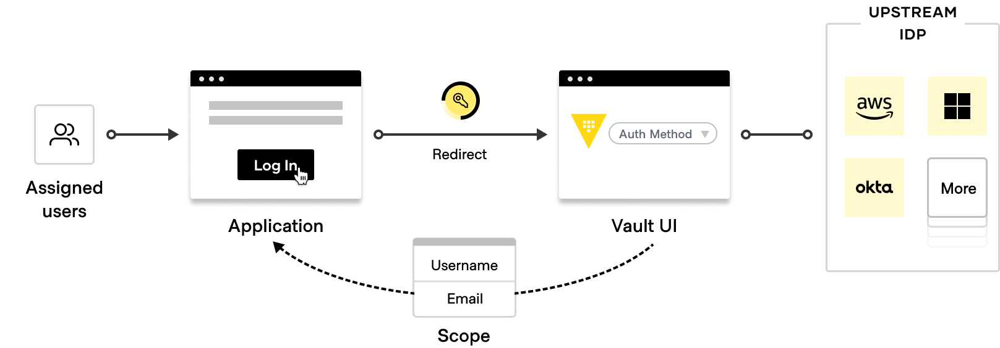
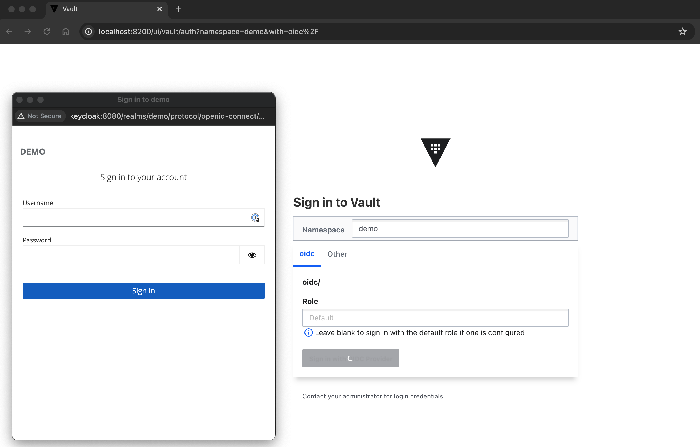

# HashiCorp Vault Integration - OIDC with KeyCloak

## PREREQS / COMPONENTS

- HashiCorp Vault
- KeyCloak
- PostgreSQL
- TerraForm
- Optional: Identity Aware Proxy (IAP)

## OVERVIEW

This repo walks through how to set up Vault and Keycloak for OIDC Authentication.





## BASICS

#### High Level Setup
- **HCLIC**: You will need to provide your own Vault Enterprise License File
  - Place your  `vault.hclic` in the `root` of this repo when you execute your setup and configurations via `make`
- **Sequence**:
  - (*Optional*) Clone and Link Vault and Keycloak Repos
    - `./docker-vault`
    - `./docker-keycloak`
  - (*Optional*) Spin up Vault and Keycloak (along with PostgreSQL)
  - Configure Vault and Keycloak for OIDC
    - `./integration`
    - Requirements:
      - Vault URL
      - Vault Token
      - Keycloak URL
      - Keycloak User
      - Keycloak Password
    - You may need to manually edit the `./integrations/terraform/terraform.auto.tfvars` or other environment variables if you're not using the local Docker instances of Vault and Keycloak.

#### Environment Variables
| KEY | DEFAULT |
|------|-------------|
| `vault_url` | http://localhost:8200 |
| `keycloak_url`  | http://localhost:8080 |
| `vault_root_token` | `cat docker-vault/terraform/data/scripts/vault.json \| jq -r '.root_token'` |
| `keycloak_user` | **admin** |
| `keycloak_password` | **passw0rd** |

## USAGE
#### Vault-Keycloak OIDC Integration Only
If you already have a Vault and Keycloak environment running somewhere, you just need to set your environment variables with the relevant inputs.
###### Set up OIDC Integration
```shell
make -f Makefile integrate-only
```
###### Clean OIDC Integration
```shell
make -f Makefile clean-integrate
```

#### Spin up Vault, Keycloak, and set up OIDC Integration
Instantiate Vault and Keycloak then integrate OIDC between the two platforms.
###### Spin up
```shell
make -f Makefile testbed-all
```
###### Clean
```shell
make -f Makefile clean-all
```

#### 

## FILES
.
├── LICENSE
├── Makefile
├── README.md
├── assets
├── docker-keycloak -> ./tmp/testbed-docker-keycloak/docker-keycloak
├── docker-vault -> ./tmp/hcp-vault-docker-enterprise/docker-vault
├── integration
│   ├── Makefile
│   ├── docker-compose
│   │   └── vault-agent
│   └── terraform
│       ├── 00.variables.tf
│       ├── 00.versions.tf
│       ├── 01.keycloak.tf
│       ├── 01.vault.tf
│       ├── 99.outputs.tf
│       ├── templates
│       │   ├── app1_owner_policy.tpl
│       │   ├── app1_reader_policy.tpl
│       │   ├── app2_owner_policy.tpl
│       │   ├── app2_reader_policy.tpl
│       │   ├── vault_admin_policy.tpl
│       │   └── vault_super_admin_policy.tpl
│       ├── terraform.auto.tfvars
│       ├── terraform.tfstate
│       └── terraform.tfstate.backup
├── terraform.tfstate
├── utility
└── vault.hclic

---

## OIDC ENTITY MATRIX

| ENTITY | PASSWORD | KEYCLOAK REALM | KEYCLOAK ROLE | VAULT NAMESPACE | VAULT POLICY |
|-|-|-|-|-|-|
| alice | alice | demo | `vault_super_admin_role` | root, demo | [vault_super_admin_policy.tpl](./integration/terraform/templates/vault_super_admin_policy.tpl) |
| bob | bob | demo | `vault_admin_role` | root, demo | [vault_admin_policy.tpl](./integration/terraform/templates/vault_admin_policy.tpl) |
| carol | carol | demo | `app1_owner_role` | root, demo | [app1_owner_policy.tpl](./integration/terraform/templates/app1_owner_policy.tpl) |
| dan | dan | demo | `app2_owner_role` | root, demo | [app2_owner_policy.tpl](./integration/terraform/templates/app2_owner_policy.tpl) |

---

## CONTAINERS

| CONTAINER | NETWORK | IP | PORT-INTERNAL | PORT-EXTERNAL |
|-|-|-|-|-|
| vault_s1 | vault-ent-network | 10.88.0.18 | 8200 | 8200 |
| vault_s2 | vault-ent-network | 10.88.0.28 | 8200 | 28200 |
| vautl_s3 | vault-ent-network | 10.88.0.38 | 8200 | 38200 |
| keycloak | vault-ent-network | 10.88.0.100 | 8080 | 8080 |
| postgresql | vault-ent-network | 10.88.0.101 | 5432 | 5432 |
---

## TERRAFORM
#### Requirements

| Name | Version |
|------|---------|
| <a name="requirement_terraform"></a> [terraform](#requirement\_terraform) | >= 0.13 |
| <a name="requirement_keycloak"></a> [keycloak](#requirement\_keycloak) | >= 3.0.0 |
| <a name="requirement_vault"></a> [vault](#requirement\_vault) | >= 3.0.0 |

#### Providers

| Name | Version |
|------|---------|
| <a name="provider_keycloak"></a> [keycloak](#provider\_keycloak) | 4.4.0 |
| <a name="provider_vault"></a> [vault](#provider\_vault) | 3.25.0 |

#### Modules

No modules.

#### Resources

| Name | Type |
|------|------|
| [keycloak_openid_client.openid_client](https://registry.terraform.io/providers/mrparkers/keycloak/latest/docs/resources/openid_client) | resource |
| [keycloak_openid_user_client_role_protocol_mapper.user_client_role_mapper](https://registry.terraform.io/providers/mrparkers/keycloak/latest/docs/resources/openid_user_client_role_protocol_mapper) | resource |
| [keycloak_realm.demo](https://registry.terraform.io/providers/mrparkers/keycloak/latest/docs/resources/realm) | resource |
| [keycloak_role.app1_owner_role](https://registry.terraform.io/providers/mrparkers/keycloak/latest/docs/resources/role) | resource |
| [keycloak_role.app2_owner_role](https://registry.terraform.io/providers/mrparkers/keycloak/latest/docs/resources/role) | resource |
| [keycloak_role.vault_admin_role](https://registry.terraform.io/providers/mrparkers/keycloak/latest/docs/resources/role) | resource |
| [keycloak_role.vault_super_admin_role](https://registry.terraform.io/providers/mrparkers/keycloak/latest/docs/resources/role) | resource |
| [keycloak_user.user_alice](https://registry.terraform.io/providers/mrparkers/keycloak/latest/docs/resources/user) | resource |
| [keycloak_user.user_bob](https://registry.terraform.io/providers/mrparkers/keycloak/latest/docs/resources/user) | resource |
| [keycloak_user.user_carol](https://registry.terraform.io/providers/mrparkers/keycloak/latest/docs/resources/user) | resource |
| [keycloak_user.user_dan](https://registry.terraform.io/providers/mrparkers/keycloak/latest/docs/resources/user) | resource |
| [keycloak_user_roles.alice_roles](https://registry.terraform.io/providers/mrparkers/keycloak/latest/docs/resources/user_roles) | resource |
| [keycloak_user_roles.bob_roles](https://registry.terraform.io/providers/mrparkers/keycloak/latest/docs/resources/user_roles) | resource |
| [keycloak_user_roles.carol_roles](https://registry.terraform.io/providers/mrparkers/keycloak/latest/docs/resources/user_roles) | resource |
| [keycloak_user_roles.dan_roles](https://registry.terraform.io/providers/mrparkers/keycloak/latest/docs/resources/user_roles) | resource |
| [vault_approle_auth_backend_role.app1](https://registry.terraform.io/providers/hashicorp/vault/latest/docs/resources/approle_auth_backend_role) | resource |
| [vault_approle_auth_backend_role_secret_id.app1](https://registry.terraform.io/providers/hashicorp/vault/latest/docs/resources/approle_auth_backend_role_secret_id) | resource |
| [vault_auth_backend.approle](https://registry.terraform.io/providers/hashicorp/vault/latest/docs/resources/auth_backend) | resource |
| [vault_identity_group.app1_owner_group](https://registry.terraform.io/providers/hashicorp/vault/latest/docs/resources/identity_group) | resource |
| [vault_identity_group.app2_owner_group](https://registry.terraform.io/providers/hashicorp/vault/latest/docs/resources/identity_group) | resource |
| [vault_identity_group.vault_admin_group](https://registry.terraform.io/providers/hashicorp/vault/latest/docs/resources/identity_group) | resource |
| [vault_identity_group.vault_super_admin_group](https://registry.terraform.io/providers/hashicorp/vault/latest/docs/resources/identity_group) | resource |
| [vault_identity_group_alias.app1_owner_group_alias](https://registry.terraform.io/providers/hashicorp/vault/latest/docs/resources/identity_group_alias) | resource |
| [vault_identity_group_alias.app2_owner_group_alias](https://registry.terraform.io/providers/hashicorp/vault/latest/docs/resources/identity_group_alias) | resource |
| [vault_identity_group_alias.vault_admin_group_alias](https://registry.terraform.io/providers/hashicorp/vault/latest/docs/resources/identity_group_alias) | resource |
| [vault_identity_group_alias.vault_super_admin_group_alias](https://registry.terraform.io/providers/hashicorp/vault/latest/docs/resources/identity_group_alias) | resource |
| [vault_identity_oidc_key.keycloak_provider_key_demo](https://registry.terraform.io/providers/hashicorp/vault/latest/docs/resources/identity_oidc_key) | resource |
| [vault_identity_oidc_key.keycloak_provider_key_root](https://registry.terraform.io/providers/hashicorp/vault/latest/docs/resources/identity_oidc_key) | resource |
| [vault_jwt_auth_backend.keycloak_demo](https://registry.terraform.io/providers/hashicorp/vault/latest/docs/resources/jwt_auth_backend) | resource |
| [vault_jwt_auth_backend.keycloak_root](https://registry.terraform.io/providers/hashicorp/vault/latest/docs/resources/jwt_auth_backend) | resource |
| [vault_jwt_auth_backend_role.default_demo](https://registry.terraform.io/providers/hashicorp/vault/latest/docs/resources/jwt_auth_backend_role) | resource |
| [vault_jwt_auth_backend_role.default_root](https://registry.terraform.io/providers/hashicorp/vault/latest/docs/resources/jwt_auth_backend_role) | resource |
| [vault_kv_secret_v2.app1_secret](https://registry.terraform.io/providers/hashicorp/vault/latest/docs/resources/kv_secret_v2) | resource |
| [vault_kv_secret_v2.app2_secret](https://registry.terraform.io/providers/hashicorp/vault/latest/docs/resources/kv_secret_v2) | resource |
| [vault_mount.kvv2](https://registry.terraform.io/providers/hashicorp/vault/latest/docs/resources/mount) | resource |
| [vault_namespace.demo](https://registry.terraform.io/providers/hashicorp/vault/latest/docs/resources/namespace) | resource |
| [vault_policy.app1_owner](https://registry.terraform.io/providers/hashicorp/vault/latest/docs/resources/policy) | resource |
| [vault_policy.app1_reader](https://registry.terraform.io/providers/hashicorp/vault/latest/docs/resources/policy) | resource |
| [vault_policy.app2_owner](https://registry.terraform.io/providers/hashicorp/vault/latest/docs/resources/policy) | resource |
| [vault_policy.app2_reader](https://registry.terraform.io/providers/hashicorp/vault/latest/docs/resources/policy) | resource |
| [vault_policy.vault_admin](https://registry.terraform.io/providers/hashicorp/vault/latest/docs/resources/policy) | resource |
| [vault_policy.vault_super_admin](https://registry.terraform.io/providers/hashicorp/vault/latest/docs/resources/policy) | resource |
| [vault_approle_auth_backend_role_id.app1](https://registry.terraform.io/providers/hashicorp/vault/latest/docs/data-sources/approle_auth_backend_role_id) | data source |

#### Inputs

| Name | Description | Type | Default | Required |
|------|-------------|------|---------|:--------:|
| <a name="input_keycloak_password"></a> [keycloak\_password](#input\_keycloak\_password) | Keycloak Password | `string` | `""` | no |
| <a name="input_keycloak_url"></a> [keycloak\_url](#input\_keycloak\_url) | Keycloak URL | `string` | `"http://keycloak:8080"` | no |
| <a name="input_keycloak_user"></a> [keycloak\_user](#input\_keycloak\_user) | Keycloak User | `string` | `""` | no |
| <a name="input_vault_root_token"></a> [vault\_root\_token](#input\_vault\_root\_token) | Vault Root Token | `string` | `""` | no |
| <a name="input_vault_url"></a> [vault\_url](#input\_vault\_url) | Vault URL | `string` | `"http://localhost:8200"` | no |

#### Outputs

No outputs.

---

## REFERENCES
##### OIDC
- https://openid.net/developers/how-connect-works/
- https://openid.net/specs/openid-connect-basic-1_0.html
- https://developer.okta.com/docs/concepts/oauth-openid/

##### Vault
- https://developer.hashicorp.com/vault/docs/auth/jwt
- https://developer.hashicorp.com/vault/docs/auth/jwt/oidc-providers/keycloak
- https://developer.hashicorp.com/vault/api-docs/auth/jwt

##### KeyCloak
- https://www.keycloak.org/server/configuration
- https://www.keycloak.org/getting-started/getting-started-docker

##### Miscellaneous
- https://en.wikipedia.org/wiki/Alice_and_Bob
- https://jwt.io/
- https://github.com/nicklhw/vault-keycloak

## AKNOWLEDGEMENTS
Thanks to **[@nicklhw](https://github.com/nicklhw/vault-keycloak "@nicklhw")**
